## **一、项目背景** 

​	ShenYu Admin 作为一个异步的，高性能的，跨语言的，响应式的 API 网关 正成为越来越多企业和个人的首选。 然而，目前在管理不同业务线需求的网关时，常常需要同时部署多个 ShenYu Admin 和多套 ShenYu Gateway。为了确保数据独立性，通常每个网关只能连接一 个 ShenYu Admin。但是，这样的架构会增加用户使用成本和运维成本。 为了提供更便捷的使用体验，ShenYu Admin 计划引入命名空间的概念，用 于管理不同业务线的网关数据。企业或个人用户只需配置一套 ShenYu Admin 和 ShenYu Bootstrap 服务，然后通过命名空间来管理不同业务线的网关数据。这 样一来，用户就能够降低使用和运维成本，同时享受更简便的管理体验。

## **二、项目相关仓库及其资料** 

Apache ShenYu 仓库： 

- 前端 https://github.com/apache/shenyu-dashboard 

- 后端 https://github.com/apache/shenyu 
- 文档 https://github.com/apache/shenyu-website

## **三、**项目详细方案

### **功能简述** 

引入命名空间实现多条业务线之间的数据隔离，shenyu client 通过配置命 名空间实现数据上报到 shenyu admin 指定命名空间，shenyu bootstrap 通过配 置唯一命名空间实现唯一 shenyu admin 指定命名空间数据读取。默认存在 default 命名空间、以兼容 shenyu 之前的版本

### 1.Shenyu Admin 端 

1.1 新增命名空间管理功能，用户可以新增命名空间，对已有的命名空间的 部分信息修改，并且可以对废弃的命名空间进行删除。 

1.2 插件配置和基础配置、文档说明一级目录下的所有二级目录均支持命名 空间的隔离，用户可以在界面上实现命名空间的切换，在 A 命名空间上的操作不 会影响到 B 命名空间的数据。 

### 2.Shenyu Bootstrap 端 

2.1 可以给每个 Shenyu Bootstrap 以配置文件的方式绑定一个命名空间， 实现 Shenyu Bootstrap 从 Shenyu Admin 拿到指定命名空间下的 Plugin、 Selector、Rule、Discovery、Auth 等数据。 

### 3.Shenyu Client 端

3.1 引入 Shenyu Client 的下游服务，可以通过配置文件的方式绑定一个命 名空间，从而实现相关数据注册到 Shenyu Admin 指定的命名空间

### **功能原型设计**

### 1.命名空间（namespace）原型设计 

#### 1.1 Shenyu Admin 端

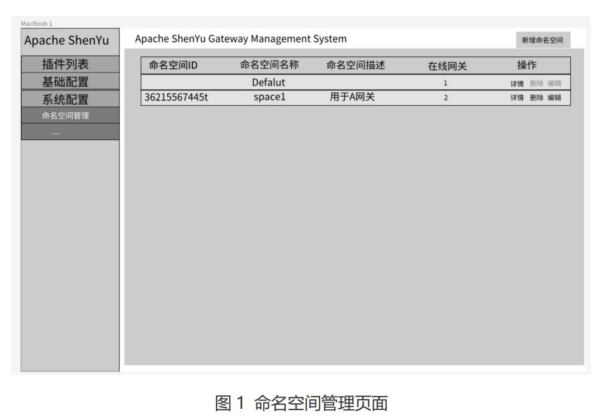

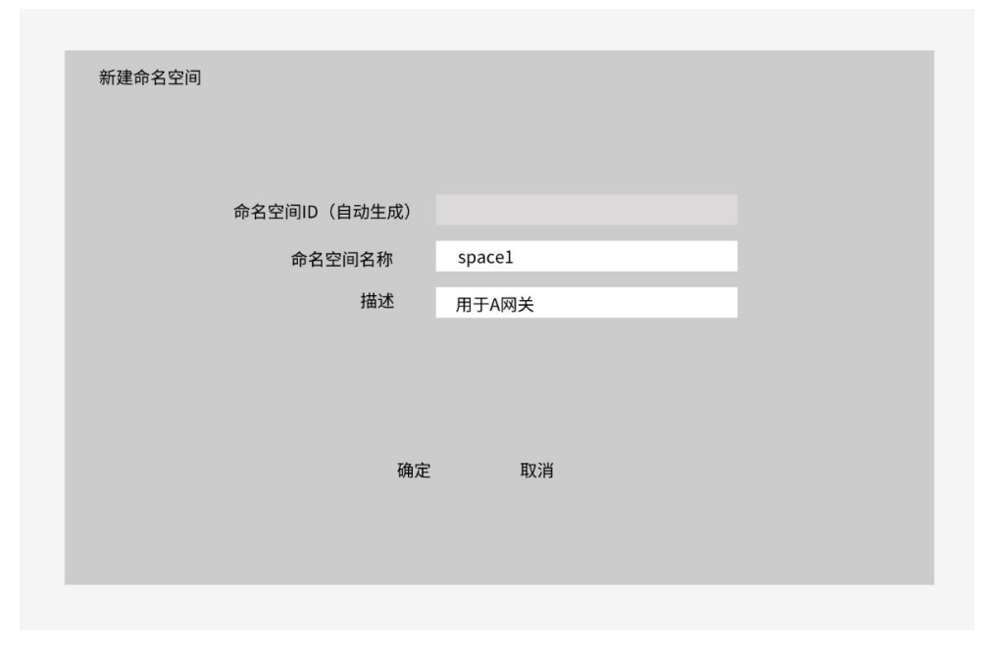

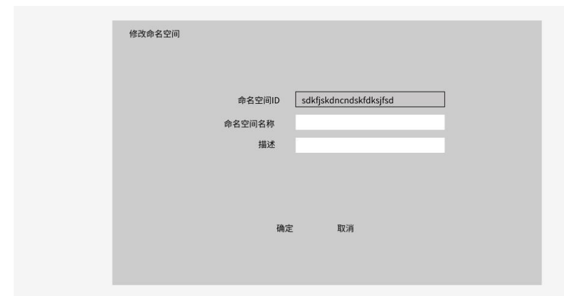

图 1 展示了命名空间管理页面，里面展示了所有的命名空间信息，包括命 名空间 ID、命名空间名称、命名空间相关描述、命名空间下在线网关的数目 

图 2、图 3 分别展示了对命名空间信息的创建和修改操作，新增命名空间时， 用户只需填写命名空间名称、描述，命名空间 namespace_id 将在保存后自动生 成，namespace_id 将作为命名空间的唯一标识配置于 bootstrap 和 client 端， 因此生成后不支持修改。 

#### 1.2 Shenyu Bootstrap 端

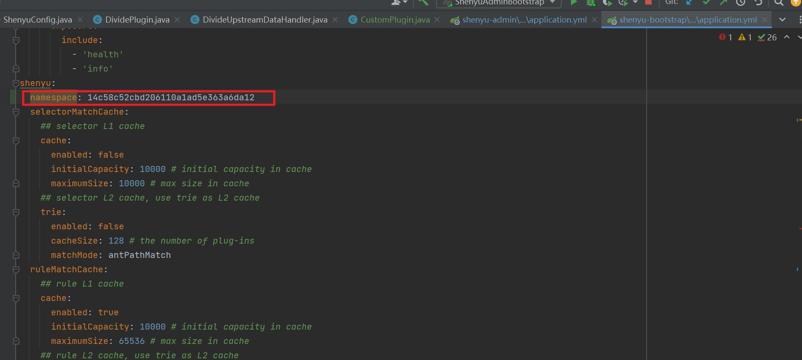

上图 展示了给 Shenyu Bootstrap 服务配置了 namespace_id 为 14c58c52cbd206110a1ad5e363a6da12 的命名空间，在 Bootstrap 启动后，该 Bootstrap 服务就只同步该命名空间的相关数据。如果用户没有配置 namespace， Bootstrap 将同步 default 命名空间的相关信息，以兼容之前版本。如果用户配 置了一个 shenyu admin 中不存在的 namespace_id，那么将不会同步任何数据。 Bootstrap 仅只支持绑定一个命名空间。

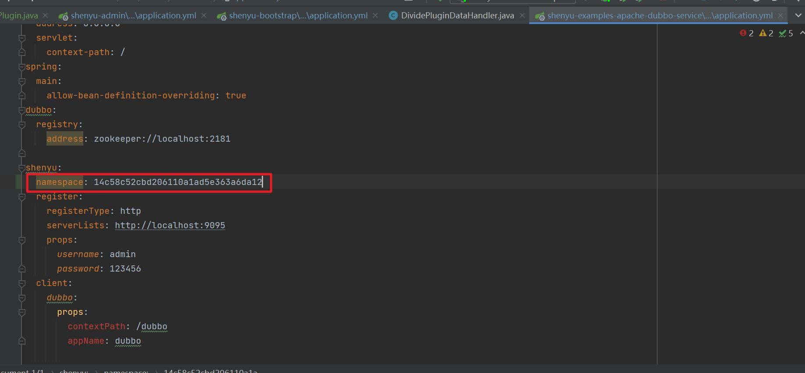

上图 展示了下游服务在引入了 shenyu client 后在配置文件中配置了 namespace_id 为 14c58c52cbd206110a1ad5e363a6da12 的命名空间，在下游服务 启动后，将会将相关数据同步给 shenyu admin 对应命名空间。如果 admin 中不 存在该 namespace_id 的命名空间。如果用户没有配置 namespace，那么 client 将相关信息同步给 admin 中 default 的命名空间，以兼容之前的版本。（支持多 namespace 配置，以（,）隔开）

### 2.Plugin 模块原型改造

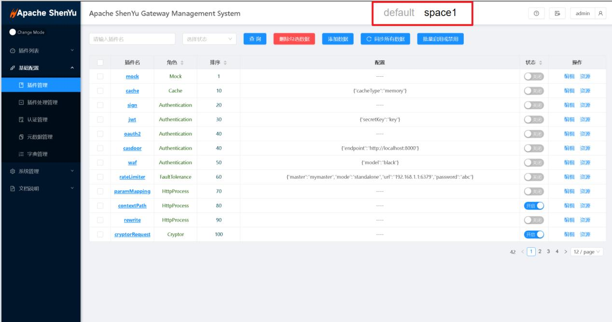

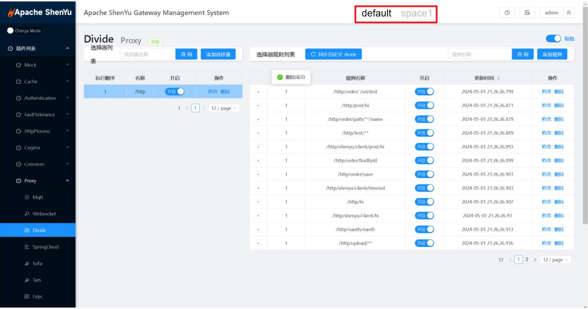

上图展示了引入命名空间隔离后插件管理的页面，用户可以在右上 角可以切换命名空间，从而实现对不同命名空间的插件管理的动态配置。命名空 间的隔离将应用插件列表、基础配置、文档说明三个一级目录下所有的页面和数 据。

**selector 、 Rule、Metadata、discovery、Auth   模块原型改造类似**

### 

### 详细设计

本章将阐述 Namespace 和 Group 的数据结构，同时因为 namespace 和 group将影响 plugin、selector、rule、metadata、discovery、auth、alert 等模块，本章就阐述以上提到几个模块的数据结构的改造

### **1.Namespace**

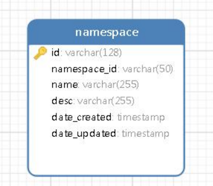

### 2.**plugin 模块数据结构的改造**

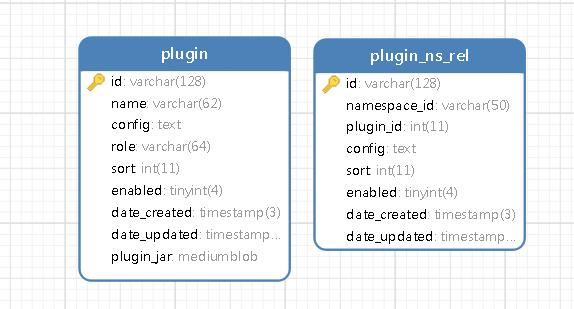

改造后，原有的 plugin 表更像是一个插件组的默认模板，里面定义了一系 列插件的默认配置、排序、启用情况，而 plugin_ns_rel 则是插件组在某个 namespace 的具体插件组的个性化配置（支持命名空间隔离配置的字段 config、 sort、enable）。

#### 2.1 新增字段解释 

Namespace_id: 命名空间系统自动生成的 id

#### 2.2 初始数据设定

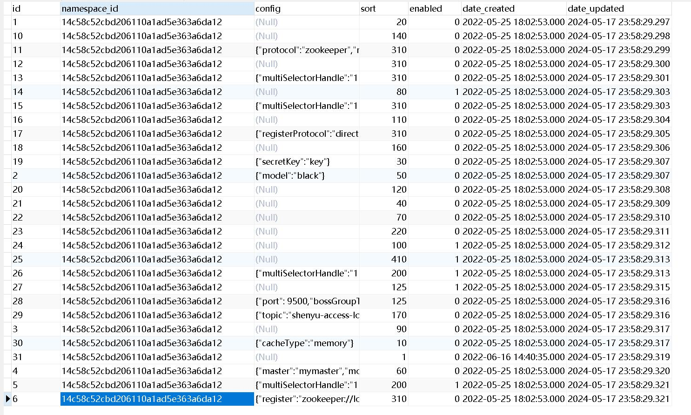

图中展示的是项目初始化时 plugin_ns_rel 表的初始值，表示默认命名空间 default 下插件组配置。

### 3.selector和rule 模块数据结构的改造

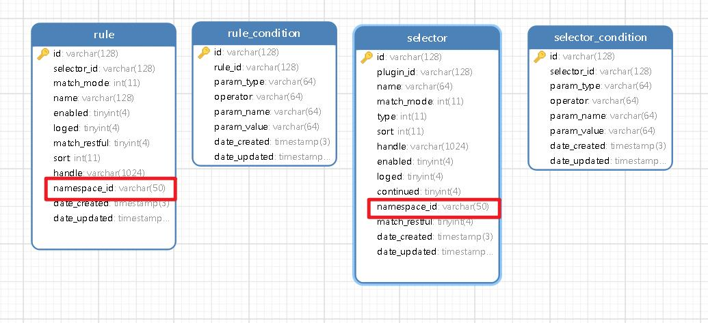

改造后的 selector 和 rule 都新增了 namespace_id，表明了一条 selector、 rule 属于某个命名空间，由于 selector_condition 和 rule_condition 都对应 唯一一个 selector 或 rule，也因此间接绑定了命名空间，无需另外加字段表示 他们的隔离信息。

**selector 、 Rule、Metadata、discovery、Auth   模块改造类似，都是加上namespaceId字段来做隔离**

### 实现方案简要设计

#### **1. plugin、selector、rule 模块**

Shenyu-client 会向 shenyu-admin 请求写入 metaData 数据，只需要给 metaData 实体新增 namespace 的信息，到达 admin 后由 admin 解析成 selector、rule 信息时，多增加一个 namespace 的信息存入数据库，推送至 shenyu bootstrap 也在同步的事件中加入 namespace 信息，全量推送给全部 bootstrap。各个 bootstrap 拿到全量信息后，根据自己的 namespaceid 进行过滤筛选。

#### 2.discovery 模块

 discovery 模块分为 local 模式和注册中心模式，两种模式需要分开考虑设计。

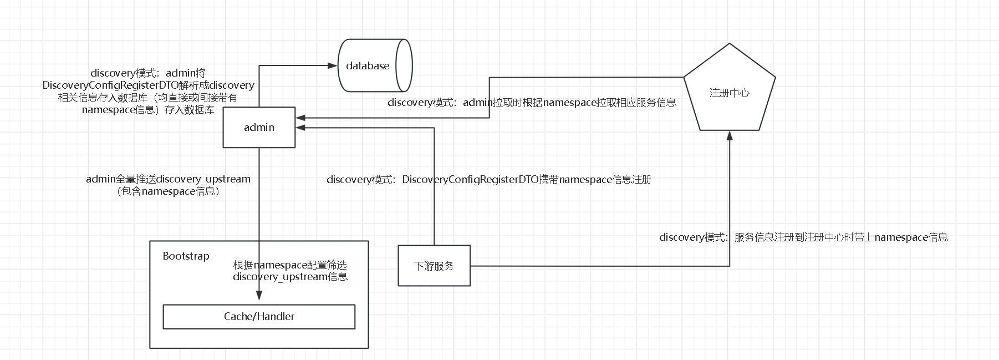

启用注册中心的模式的情况下，下游服务 shenyu-client 上传的服务发现配置信息新增 namespace 信息，同时将服务信息（upstream）发送到注册中心时，也带上 namespace 信息。 Shenyu-admin 拿到服务发现配置信息时，会将 discovery 相关的信息进行落库，这里都会带 上 namespace 信息。完成落库操作后，admin 会发起与注册中心的连接，此时拉到的注册中 心的服务信息（upstream）都是带有 namespaceId 的，在原来的对注册中心的 upstream 信 息的处理上，再新增 namespace 的筛选。

#### 3.auth 模块

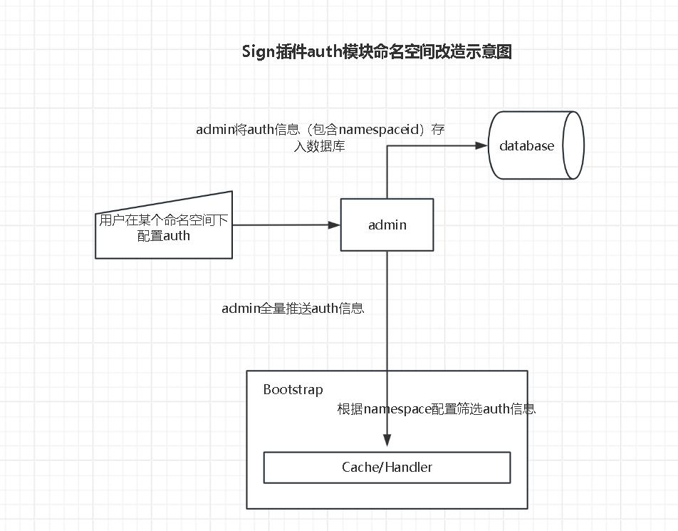

#### 4.alert 模块

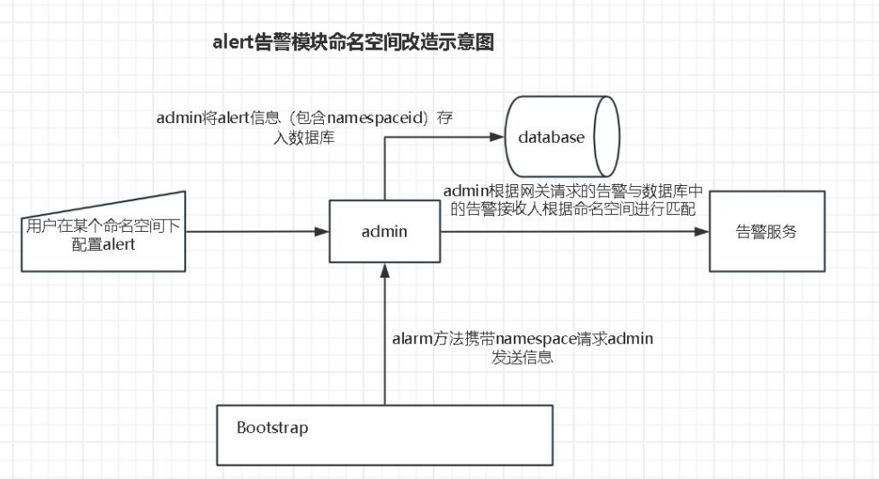

